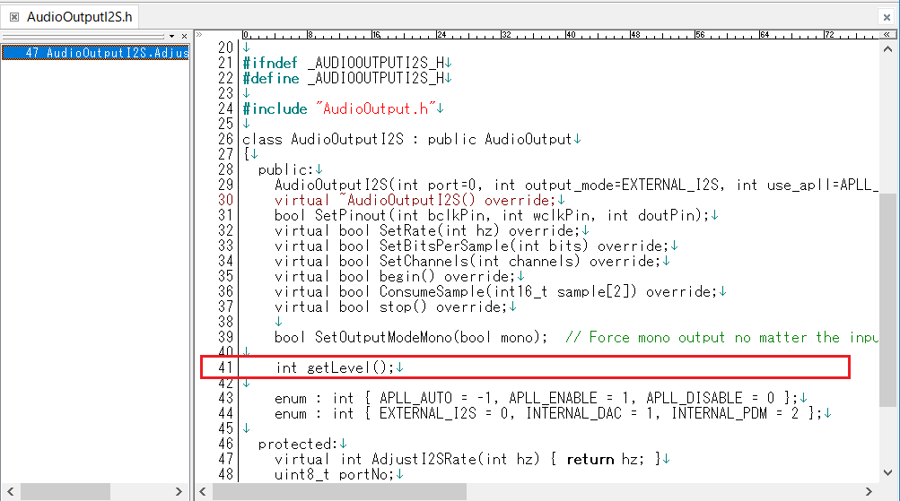
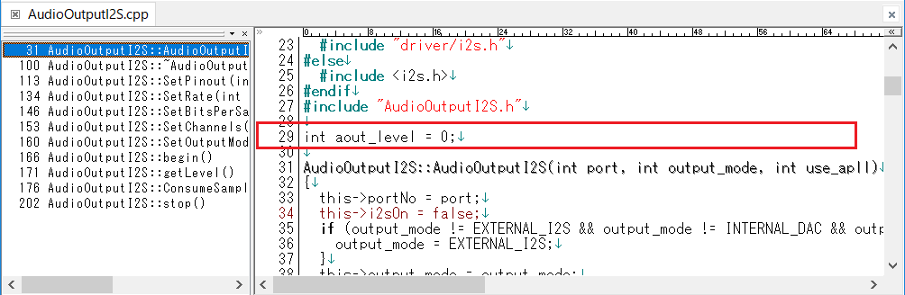
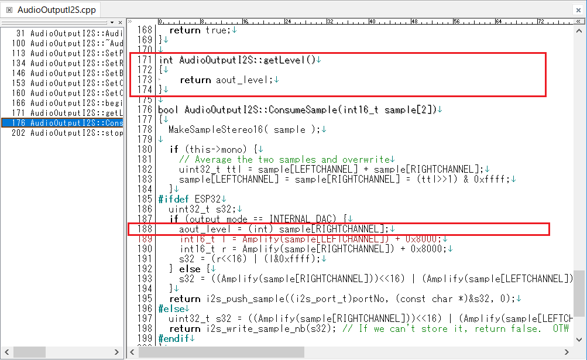
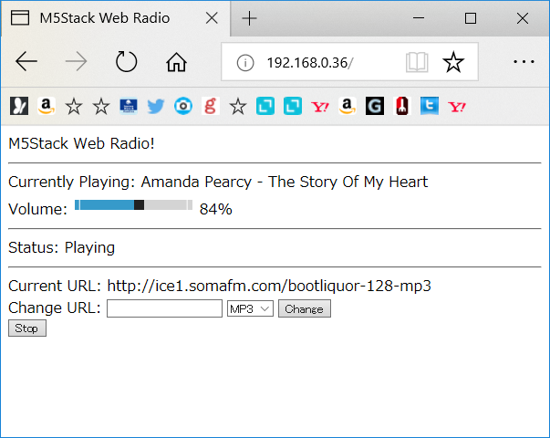

# M5Stack_WebRadio_Avatar
M5StackでAvatar表示付きWebRadio

WebRadioは、ESP8266Audio Libraryのexample"WebRadio"をベースにさせていただきました。  
Avatar表示は、meganetaaanさんのm5stack-avatorをベースにさせていただきました。 
オリジナルはこちら。 
An M5Stack library for rendering avatar faces <https://github.com/meganetaaan/m5stack-avator> 

---
### 注意：未対策の不具合が有ります ###
M5Stackが動作中に電源ボタンをクリックしてリセットした場合は正常に動きません。 
M5Stackの電源ボタンをダブルクリックして一度電源を切ってから再度電源をいれて下さい。 
M5Stackにスケッチを書き込んだ直後もPCからUSBケーブルを抜いて一度M5Stackの電源を切ってください。 

### 必要な物 ###
* [M5Stack](http://www.m5stack.com/ "Title") (Grayで動作確認をしました。) 
* Arduino IDE (1.8.5で動作確認をしました。) 
* [Arduino core for the ESP32](https://github.com/espressif/arduino-esp32 "Title")
* [M5Stack Library](https://github.com/m5stack/M5Stack.git "Title")
* [ESP8266Audio](https://github.com/earlephilhower/ESP8266Audio/ "Title")  

### WiFiの設定 ###
* M5Stack_WebRadio_Avator.inoの135行目付近、SSIDとPASSWORDを設定してください。

### ESP8266Audioライブラリの修正 ###
* "AudioOutputI2S.h"に下図赤枠部分を追加します。
  
* "AudioOutputI2S.cpp"に下図赤枠部分を追加します。
 
   

### 操作方法 ###
~~(注意：2019年2月時点での"Arduino core for the ESP32"では操作パネルが表示されませんでした。)~~  
1. M5M5Stackの電源を入れるとWiFi APに接続し、APから割り当てられたIPアドレスが表示されます。
2. 表示されたIPアドレスにブラウザでアクセスすると操作パネルが表示されます。
  
3. もし操作パネルで不正なURLを設定して起動途中でリセットがかかるようになった時は、一度M5Stackの電源を切ってからAボタンを押しながら電源を入れてください。 
この時Avatarが表示されるまでAボタンを押し続けてください。
   

### WebRadioの参考URL ###
<http://wbgo.streamguys.net/thejazzstream> 
<http://beatles.purestream.net/beatles.mp3> 
<http://listen.181fm.com/181-beatles_128k.mp3> 
<http://ice1.somafm.com/illstreet-128-mp3> 
<http://ice1.somafm.com/secretagent-128-mp3> 
<http://ice1.somafm.com/seventies-128-mp3> 
<http://ice1.somafm.com/bootliquor-128-mp3> 
<http://stream.srg-ssr.ch/m/rsj/mp3_128> 
<http://icecast.omroep.nl/3fm-sb-mp3>  

